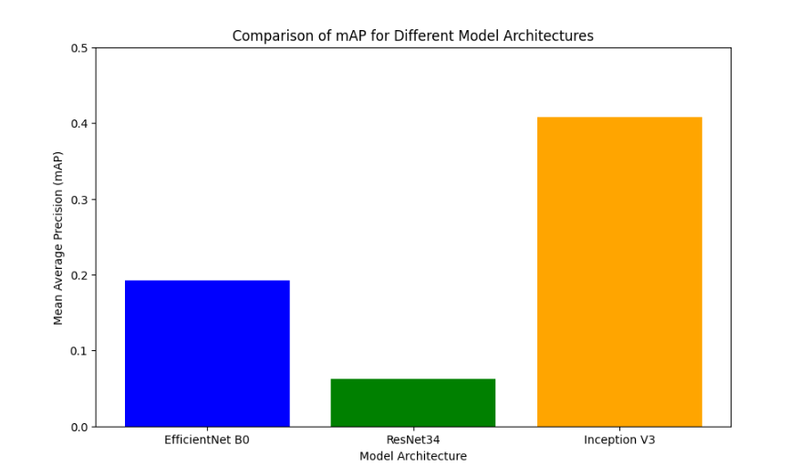
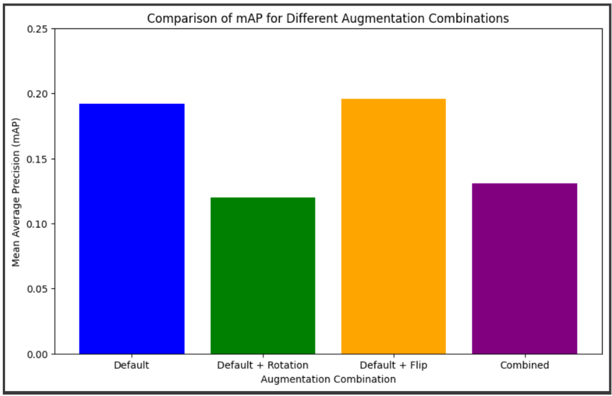
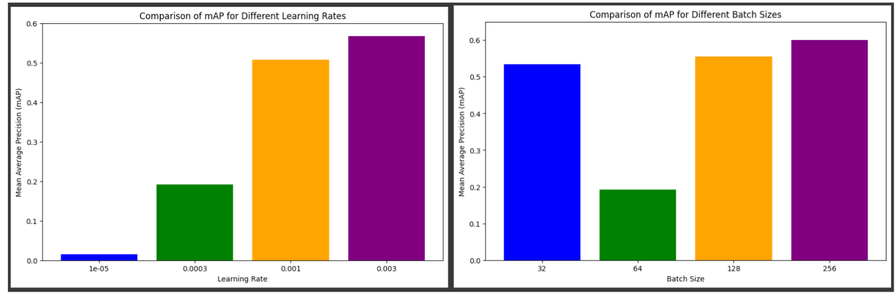

# 🔪 Knife Classification in Real-World Images  
**Coursework for EEEM066 – Fundamentals of Machine Learning, University of Surrey**

This project tackles the problem of fine-grained **knife classification** across 192 classes using deep learning models. It explores architectural choices, hyperparameter tuning, and augmentation strategies for improving classification performance.

---

## 📌 Overview

- **Dataset**: 9,928 real-world knife images (192 classes) + 351 test samples  
- **Metric**: mean Average Precision (mAP)  
- **Goal**: Optimize classification performance using CNNs and training pipeline enhancements

---

## 🧠 Models Used

| Model            | mAP     | Training Time |
|------------------|---------|----------------|
| EfficientNet B0  | 0.192   | 16.4 min        |
| ResNet-34        | 0.063   | 7.8 min         |
| Inception V3     | **0.408**   | 7.9 min         |

---

## 🔄 Augmentation Experiments

Default config: `Color Jitter`  
Additional tested: `Horizontal Flip`, `Random Rotation`, and combinations.

| Augmentation Combo         | mAP   |
|---------------------------|-------|
| Default                   | 0.192 |
| Default + Flip            | 0.238 |
| Default + Rotation        | 0.255 |
| Flip + Rotation + Default | **0.294** |

---

## ⚙️ Hyperparameter Tuning

**Learning Rates:**

| LR       | mAP   |
|----------|-------|
| 0.00001  | 0.015 |
| 0.0003   | 0.192 |
| 0.001    | 0.507 |
| 0.003    | **0.586** |

**Batch Sizes with LR=0.003:**

| BS   | mAP   |
|------|-------|
| 32   | 0.534 |
| 64   | 0.192 |
| 128  | 0.555 |
| 256  | **0.600** |

---

## 📁 Files

| File | Description |
|------|-------------|
| `EEEM066_CW1_TAMAN_BACHANI_6846172.ipynb` | Full code with model training and tuning |
| `EEEM066_CW1_Report_TAMAN_BACHANI_6846172.pdf` | Final coursework report (optional to view) |
| `assets/` | Figures and visual results for this project |

---

## 📊 Key Takeaways

- Inception V3 outperformed others in base architecture tests.
- Combined augmentations noticeably improved model robustness.
- Careful tuning of learning rate and batch size significantly boosted performance (from 0.192 to 0.600 mAP).

---

## 👨‍💻 Author

**Taman Bachani**  
MSc Artificial Intelligence – University of Surrey  
[GitHub](https://github.com/your-username) | [LinkedIn](https://linkedin.com/in/tamanbachani)

